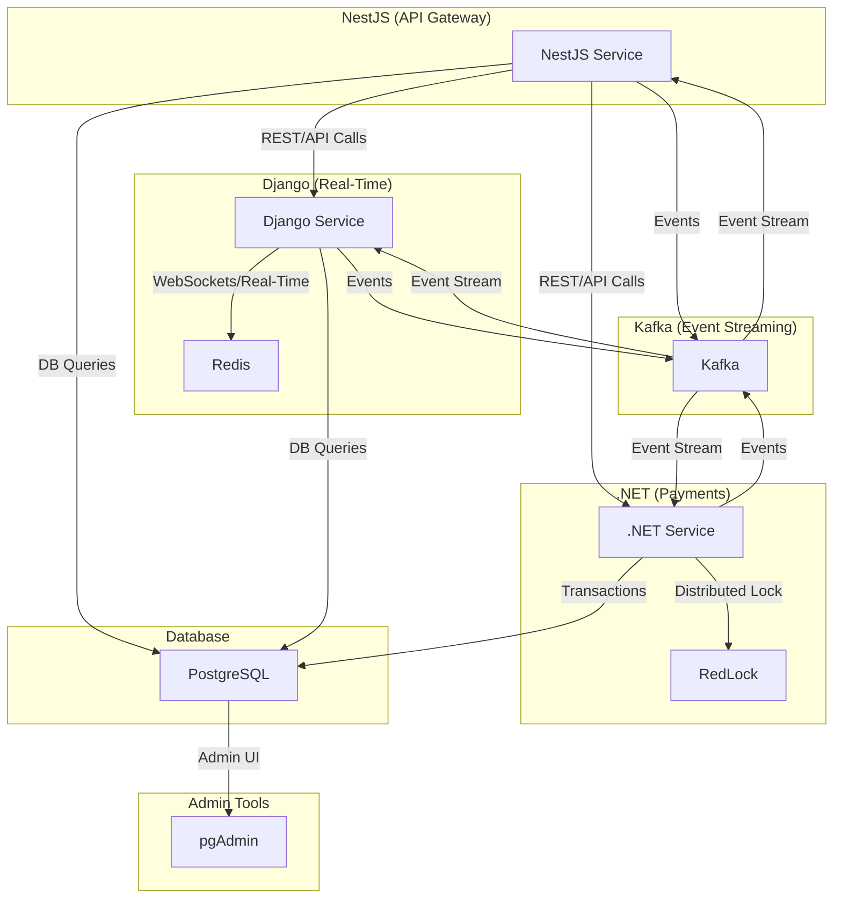

# Real Estate Microservices Project


---

## 🚦 CI/CD & Quality

- **CI/CD:** Automated with [GitHub Actions](https://github.com/features/actions)
- **Build:** On every push and pull request to `main`
- **Tests:** All backend services run their test suites in CI
- **Coverage:** Code coverage is reported via Codecov
- **Linting:** Code style is checked with Prettier and linters

### Example Workflow

- On push or PR, the following steps run:
  1. Checkout code and set up environment
  2. Build Docker images for all services (Django, NestJS, .NET)
  3. Install dependencies for each service
  4. Run unit and integration tests for Django, NestJS, and .NET
  5. Lint code for all services (e.g., flake8, eslint, dotnet format)
  6. Upload code coverage to Codecov
  7. Build and push Docker images to registry (if configured)
  8. Deploy to staging/production (if configured)
  9. Notify team via Slack/Email (if configured)

- **Artifacts:** Test reports, coverage, and build logs are available in the Actions tab.
- **Manual triggers:** You can manually trigger workflows for hotfixes or redeployments.
- **Secrets:** All sensitive data (API keys, tokens) are stored in GitHub Actions secrets.

You can view the status in the badges above or in the [Actions tab](https://github.com/mo7amed4522/real_state/actions).

---

## 🗺️ Architecture Diagram & Technical Details



### Technical Details
- **NestJS** acts as the API gateway, handling all client requests, aggregating data, and orchestrating calls to Django and .NET services.
- **Django** provides real-time features (chat, notifications) using Channels and Redis for WebSocket support. It also listens to Kafka for real-time events and updates.
- **.NET** handles all payment and transaction logic, using RedLock (distributed Redis lock) to ensure safe, atomic transactions. It emits events to Kafka for other services to react to payment changes.
- **Kafka** is the backbone for real-time event streaming and inter-service communication. All services publish and subscribe to relevant topics for instant updates.
- **PostgreSQL** is the main data store, accessed by all services for persistent data.
- **pgAdmin** provides a UI for database management and inspection.
- **Flutter** (in `real_state_app/`) is used for the cross-platform mobile application, leveraging modern state management and local storage solutions for a seamless user experience.
- **Redis** is used for caching, real-time pub/sub, and distributed locking (via RedLock).

This architecture enables:
- **Loose coupling** between services
- **Scalable real-time updates**
- **Safe distributed transactions**
- **Event-driven workflows**
- **Easy monitoring and admin access**

---

## 🚦 Project Overview

This project is a modern, scalable **Microservices Architecture** for real estate platforms, designed for high performance, security, and real-time features.

- **NestJS** acts as the main API gateway and orchestrator, handling REST API requests, authentication, and aggregating data from the database and other services.
- **Django** is dedicated to real-time features, such as chat and notifications, leveraging Django Channels and Redis for WebSocket support and real-time database updates.
- **.NET Core** is responsible for all payment and transaction logic, including Stripe, Google/Apple Pay, and advanced transaction safety. We use **RedLock** (distributed Redis lock) to ensure all financial transactions are atomic and safe across distributed systems.
- **Kafka** is used for real-time event streaming and inter-service communication, ensuring that updates (like new messages, payments, or property changes) are instantly propagated across all services.

All services are containerized with Docker Compose for easy local development and deployment. The architecture is designed for extensibility, security, and seamless scaling.

---

## ✨ Features
- **Microservices architecture** (Django, NestJS, .NET)
- **Flutter mobile app** (with advanced state management and secure local chat storage)
- **JWT authentication** and role-based access
- **Real-time chat** with Django Channels and Redis
- **AI-powered property image/location analysis**
- **Payment processing** (Stripe, Google/Apple Pay, RedLock, idempotency)
- **File uploads** (images, videos, documents)
- **Admin and user dashboards**
- **Postman collection for all endpoints**
- **Hot reload for all services in development**
- **Easy local setup with Docker Compose**
- **Flutter app uses:**
  - `flutter_bloc` for state management
  - `equatable` for value equality
  - `go_router` for declarative routing
  - `json_serializable` for model serialization
  - `flutter_localizations` for multi-language support
  - `hive` for secure local database (used to store chat data and room information securely)

---

## 🏗️ Technology Stack

- **Django** (Python, Channels, REST Framework) — Real-time chat, property management, AI features
- **NestJS** (Node.js, TypeScript) — Authentication, user management, REST APIs
- **.NET Core** (C#) — Payment module, Stripe, Google/Apple Pay, RedLock, advanced logging
- **Flutter** (Dart, `real_state_app/`) — Cross-platform mobile app using `flutter_bloc`, `equatable`, `go_router`, `json_serializable`, `flutter_localizations`, and `hive` for secure local chat and room storage
- **PostgreSQL** — Main database
- **Redis** — Real-time, cache, distributed locks
- **Docker & Docker Compose** — Containerization and orchestration
- **pgAdmin** — Database management UI

## 📱 Mobile App (Flutter)

The `real_state_app/` directory contains a cross-platform Flutter application for iOS, Android, macOS, Windows, and Linux.

- Uses `flutter_bloc` for state management, `hive` for secure local chat storage, and supports multiple languages.
- Integrates with backend microservices for authentication, real-time chat, property management, and payments.
- To run locally:
  ```sh
  cd real_state_app
  flutter pub get
  flutter run
  ```

---

## 🐳 Docker Architecture

All services run in isolated containers and communicate via Docker Compose network:

```
[ Django ]
    |         \
[ NestJS ] -- [ PostgreSQL ] -- [ pgAdmin ]
    |         /
[ .NET  ]
    |
[ Redis ]
```

- Each service has its own Dockerfile and .env file.
- Data is persisted in Docker volumes.

---

## 🚀 Getting Started

### 1. **Clone the Repository**
```sh
git clone <your-repo-url>
cd real_state
```

### 2. **Set Up .env Files**
Create the following `.env` files in each service directory:

#### nest_service/.env
```env
PORT=3000
DB_HOST=db
DB_PORT=5432
DB_USERNAME=postgres
DB_PASSWORD=2521
DB_DATABASE=real-state
JWT_SECRET=your_jwt_secret
REDIS_HOST=redis
REDIS_PORT=6379
```

#### django_service/.env
```env
DJANGO_SETTINGS_MODULE=django_project.settings
DATABASE_URL=postgres://postgres:2521@db:5432/real-state
SECRET_KEY=your_django_secret
DEBUG=True
ALLOWED_HOSTS=*
REDIS_HOST=redis
REDIS_PORT=6379
```

#### dotnet_service/.env
```env
ASPNETCORE_ENVIRONMENT=Development
ConnectionStrings__DefaultConnection=Host=db;Port=5432;Database=real-state;Username=postgres;Password=2521
Redis__Configuration=redis:6379
```

---

### 3. **Start All Services with Docker Compose**
```sh
docker-compose up -d --build
```

- This will build and start all services: Django, NestJS, .NET, PostgreSQL, Redis, and pgAdmin.
- Data is persisted in Docker volumes.

---

### 4. **Apply Django Migrations**
```sh
docker-compose exec django_service python manage.py migrate
```

---

### 5. **Access the Services**
- **NestJS API:** http://localhost:3000
- **Django API:** http://localhost:8000
- **.NET API:** http://localhost:5000
- **pgAdmin:** http://localhost:5050 (default: admin@example.com / admin)

---

## 📦 Data & Features
- **User authentication & JWT**
- **Real-time chat (Django Channels, Redis)**
- **Property management (CRUD, images, AI analysis)**
- **Payment processing (Stripe, Google/Apple Pay, RedLock, idempotency)**
- **File uploads**
- **Postman collection for all endpoints**

---

## 🧪 Example API Usage
- Import `real_state.postman_collection.json` into Postman
- Use the provided endpoints for registration, login, email verification, password reset, chat, payments, etc.

---

## 🖼️ Technology Logos

<p align="center">
  
  
  
  
  
  
  
  
</p>

---

## 📝 Notes
- Make sure Docker Desktop is running.
- If you change `.env` files, restart the affected service with `docker-compose restart <service>`.
- For development, code changes in `django_service`, `nest_service`, and `dotnet_service` are hot-reloaded.

---

## 📬 Questions?
Open an issue or contact the maintainer at eng.khaled4522@gmail.com

---

## 🤝 Contributing

Contributions are welcome! To contribute:
1. Fork the repository
2. Create a new branch (`git checkout -b feature/your-feature`)
3. Commit your changes (`git commit -am 'Add new feature'`)
4. Push to the branch (`git push origin feature/your-feature`)
5. Open a Pull Request

Please follow the existing code style and add tests where appropriate.

### 📱 Contributing to the Mobile App

- Ensure you have Flutter SDK (see `real_state_app/pubspec.yaml` for version).
- Run `flutter pub get` before making changes.
- Follow the existing folder structure and use `flutter_bloc` for state management.
- Run tests with `flutter test` before submitting a PR.
- For localization, update ARB files in `lib/l10n/`.

---

## 🛡️ Security

- Sensitive data (API keys, secrets, DB credentials, etc.) are stored in `.env` files for each service and are not committed to version control.
- Never share or commit your `.env` files.
- JWT is used for authentication across all services.
- The Flutter app uses secure local storage (Hive) for sensitive chat and room data.

---

## 🛠️ Troubleshooting

- **Service won't start?**
  - Make sure Docker Desktop is running
  - Run `docker-compose down -v` and then `docker-compose up -d --build`
- **Port already in use?**
  - Change the port mapping in `docker-compose.yml`
- **Database connection errors?**
  - Ensure the `db` service is up and healthy
  - Check your `.env` files for correct DB credentials
- **bcrypt or native module errors in Node/NestJS?**
  - Delete `node_modules` and lock files, rebuild the Docker image
- **.NET/Redis connection issues?**
  - Make sure Redis is running and the connection string uses `redis:6379`
- **Django/Postgres version errors?**
  - Ensure you are using Postgres 14+ as required by Django

If you encounter issues not listed here, please open an issue with logs and steps to reproduce.


## 📄 License

This project is licensed under the MIT License. See the [LICENSE](LICENSE) file for details.

---

## 📬 Maintainer & Contact

- **Name:** Khaled Mohamed Abodui
- **Location:** UAE 🇦🇪  - Dubai
- **Phone:** [+971 052 537 4187](https://wa.me/971525374187)
- **Gmail:** [eng.khaled4522@gmail.com](mailto:eng.khaled4522@gmail.com)
- **WhatsApp:** [Chat on WhatsApp](https://wa.me/971525374187)

Feel free to reach out for questions, collaboration, or support! 